The admin panel is the operator control center. It handles catalog, users, payments, webhooks, endpoints, and system settings with role-based access for admins, moderators, and support staff.

## Navigation tree

```mermaid
flowchart TB
    Admin[Admin Panel]

    Admin --> D[Dashboard Overview]
    Admin --> P[Product Catalog]
    Admin --> W[Webhook Settings]
    Admin --> E[Endpoint Management]
    Admin --> U[User Management]
    Admin --> B[Payment & Billing]
    Admin --> S[System Settings]

    D --> D1[Sales Analytics]
    D --> D2[Active Users & Subs]
    D --> D3[System Health]
    D --> D4[Provider Status]

    P --> P1[Add / Edit / Remove Tools]
    P --> P2[Pricing & Availability]
    P --> P3[Categories & Tags]
    P --> P4[Inventory & Stock Alerts]

    W --> W1[Webhook URLs]
    W --> W2[Event Triggers]
    W --> W3[Delivery Logs]
    W --> W4[Retry & Signing Secrets]

    E --> E1[API Endpoints]
    E --> E2[Access Keys & Scopes]
    E --> E3[Rate Limits]
    E --> E4[Usage Logs]

    U --> U1[Customer Accounts]
    U --> U2[Roles & Permissions]
    U --> U3[Disputes & Refunds]
    U --> U4[Fraud & Risk Rules]

    B --> B1[Gateway Config]
    B --> B2[Transactions]
    B --> B3[Invoices & Receipts]
    B --> B4[Payouts & Reconciliation]

    S --> S1[Site Config]
    S --> S2[Security Policies]
    S --> S3[Backup & Restore]
    S --> S4[Feature Flags]
```



## ASCII layout

```
┌─────────────────────────────────────────────────────────────────┐
│  Logo      Search        🔔 Alerts        Admin Profile ▼        │
├──────────────┬──────────────────────────────────────────────────┤
│              │                                                   │
│  Dashboard   │   ┌─────────────┐  ┌─────────────┐  ┌──────────┐│
│  Catalog     │   │  Revenue    │  │ Active Subs │  │  Uptime  ││
│  Webhooks    │   │   $12,430   │  │    1,284    │  │  99.98%  ││
│  Endpoints   │   └─────────────┘  └─────────────┘  └──────────┘│
│  Users       │                                                   │
│  Billing     │   ┌────────────────────────────────────────────┐ │
│  Settings    │   │  Sales Trend (last 30 days)                │ │
│              │   │  ▁▂▃▅▆▇█▇▆▅▃▂▁▂▄▆█▇▅▃▂▁                    │ │
│  ───────     │   └────────────────────────────────────────────┘ │
│              │                                                   │
│  Support     │   Recent Orders          │  System Alerts        │
│  Logout      │   • #10293  SMS  $2.10   │  • Webhook retry: OK  │
│              │   • #10292  Boost $19    │  • Provider X: 200ms  │
│              │   • #10291  Virt# $4.50  │  • DB replica lag: 0s │
└──────────────┴──────────────────────────────────────────────────┘
```

## Section detail

### Dashboard Overview

- Revenue, orders, refunds, ARPU, and churn cards.
- Real-time system health from provider status pings.
- Alert center for failed webhooks, low balances, and fraud flags.

### Product Catalog

- Create, edit, archive tools with SKU, category, provider mapping, and pricing tiers.
- Bulk pricing updates and country-specific availability.
- Stock and quota alerts per provider.

### Webhook Settings

- Register multiple webhook URLs with per-event filters.
- Events: `purchase.completed`, `subscription.renewed`, `subscription.cancelled`, `payment.failed`, `refund.issued`, `fraud.flagged`.
- Signed payloads (HMAC), retries with exponential backoff, and delivery log with replay.

### Endpoint Management

- Public API endpoint registry with versioning.
- Access keys with scopes, expiry, and per-key rate limits.
- Live usage logs, error rates, and latency percentiles.

### User Management

- Search, filter, and impersonate customer accounts (audit-logged).
- Role assignment: admin, moderator, support.
- Dispute workflow: open → investigate → resolve/refund → close.
- Fraud rules engine with score thresholds and manual review queue.

### Payment & Billing

- Configure Stripe, PayPal, and crypto processors per region.
- Transaction ledger with filters, exports, and reconciliation reports.
- Invoice and receipt generation with tax handling.

### System Settings

- Site branding, legal pages, notification templates.
- Password policy, 2FA enforcement, session timeout, IP allowlists.
- Scheduled backups, on-demand snapshots, point-in-time restore.
- Feature flags for staged rollouts.

## Role matrix

| Capability | Admin | Moderator | Support |
| --- | --- | --- | --- |
| Manage catalog | ✅ | ✅ | ❌ |
| Manage users | ✅ | ✅ | View only |
| Refunds | ✅ | ✅ | Up to $50 |
| Webhooks & endpoints | ✅ | ❌ | ❌ |
| System settings | ✅ | ❌ | ❌ |
| View analytics | ✅ | ✅ | ✅ |
