The customer dashboard is the primary surface for buyers. It centralizes purchased tools, subscriptions, usage analytics, billing, and account security in a mobile-first responsive layout.

## Dashboard layout

```mermaid
flowchart LR
    subgraph Nav["Top Navigation"]
        Logo[Logo]
        Search[Search Catalog]
        Cart[Cart + Wallet Balance]
        Profile[Profile Menu]
    end

    subgraph Side["Sidebar"]
        S1[Overview]
        S2[My Tools]
        S3[Subscriptions]
        S4[Usage & History]
        S5[Billing]
        S6[Security]
        S7[Support]
    end

    subgraph Main["Main Content Area"]
        C1[Purchased Tools Grid]
        C2[Active Subscriptions]
        C3[Recent Activity Feed]
        C4[Quick Purchase Widgets]
        C5[Usage Charts]
    end

    Nav --> Side
    Side --> Main
```



## ASCII mockup

```
┌─────────────────────────────────────────────────────────────────┐
│  Logo    Search catalog…            🛒 Cart   Wallet $42   ▼    │
├──────────────┬──────────────────────────────────────────────────┤
│              │  Welcome back, Alex 👋                            │
│  Overview    │                                                   │
│  My Tools    │  ┌──────────┐  ┌──────────┐  ┌──────────┐        │
│  Subs        │  │ Active   │  │ This Mo. │  │ Wallet   │        │
│  History     │  │  Tools 7 │  │  $128.40 │  │  $42.00  │        │
│  Billing     │  └──────────┘  └──────────┘  └──────────┘        │
│  Security    │                                                   │
│  Support     │  Quick Purchase                                   │
│              │  [SMS Number] [Virtual # by Country] [Boost Pack]│
│              │                                                   │
│              │  Recent Activity                                  │
│              │  • WhatsApp SMS  +1 555… delivered  2m ago       │
│              │  • IG Boost pack renewed             1h ago      │
└──────────────┴──────────────────────────────────────────────────┘
```

## Sections

<CardGroup cols={2}>
  <Card title="Overview" icon="gauge">
    Snapshot of active tools, wallet balance, and recent activity.
  </Card>
  <Card title="My Tools" icon="toolbox">
    All purchased SMS numbers, virtual numbers, and boosting packs with status.
  </Card>
  <Card title="Subscriptions" icon="repeat">
    Renewals, upgrades, downgrades, and cancellations.
  </Card>
  <Card title="Usage & History" icon="chart-line">
    Consumption metrics, downloadable transaction history.
  </Card>
  <Card title="Billing" icon="credit-card">
    Cards, PayPal, crypto wallets, invoices, and receipts.
  </Card>
  <Card title="Security" icon="shield-halved">
    Password, 2FA, active sessions, and login alerts.
  </Card>
</CardGroup>

## Mobile behavior

- Sidebar collapses into a bottom nav on screens under 768px.
- Quick Purchase widgets stack vertically with sticky category chips.
- Tables (history, subscriptions) switch to card lists on small screens.
