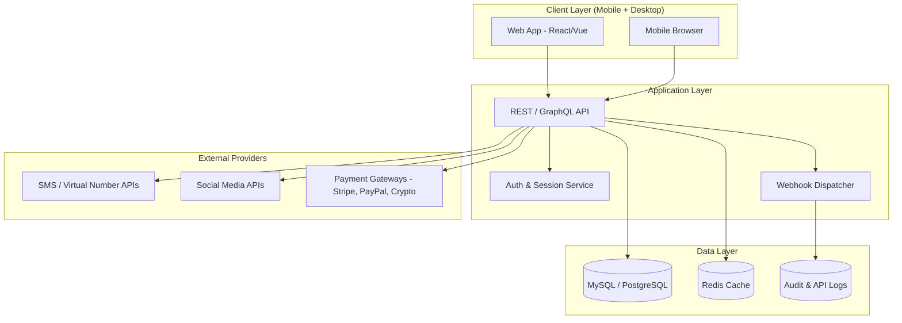
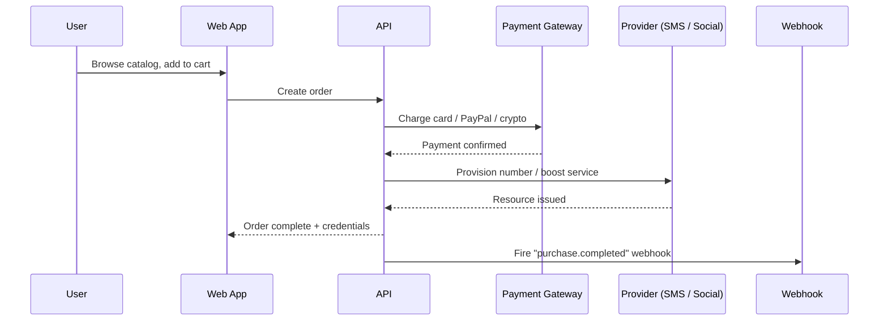
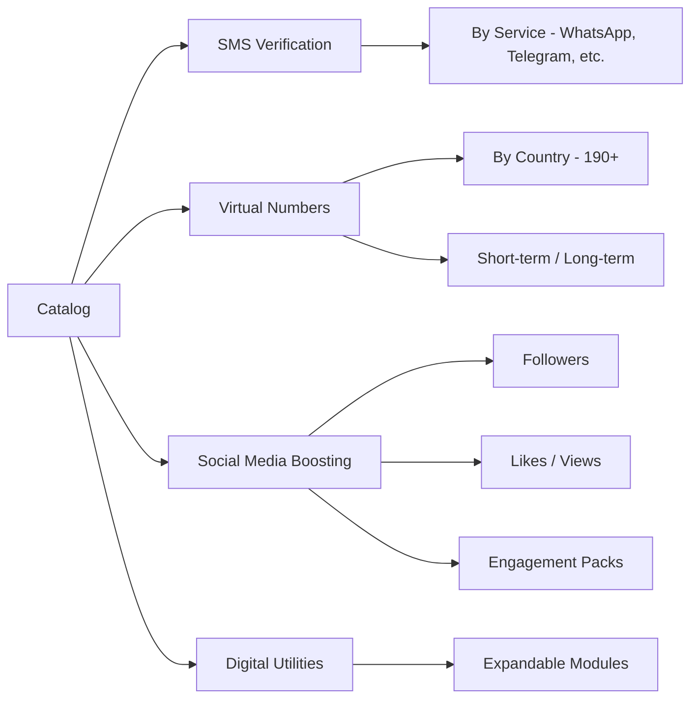

Visual wireframe of the digital marketplace platform showing the admin panel structure, customer dashboard layout, and high-level system architecture. Use these diagrams as the blueprint for build and design reviews.

## System architecture



## Customer dashboard

```mermaid
flowchart LR
    subgraph Nav["Top Navigation"]
        Logo[Logo]
        Search[Search Catalog]
        Cart[Cart]
        Profile[Profile Menu]
    end

    subgraph Side["Sidebar"]
        S1[Overview]
        S2[My Tools]
        S3[Subscriptions]
        S4[Usage & History]
        S5[Billing]
        S6[Security]
        S7[Support]
    end

    subgraph Main["Main Content Area"]
        C1[Purchased Tools Grid]
        C2[Active Subscriptions Card]
        C3[Recent Activity Feed]
        C4[Quick Purchase - SMS / Virtual # / Boosting]
        C5[Usage Charts]
    end

    Nav --> Side
    Side --> Main
```



### Customer dashboard sections

<CardGroup cols={2}>
  <Card title="Overview" icon="gauge">
    Snapshot of active tools, balance, and recent activity.
  </Card>
  <Card title="My Tools" icon="toolbox">
    All purchased SMS numbers, virtual numbers, and boosting packs.
  </Card>
  <Card title="Subscriptions" icon="repeat">
    Manage renewals, upgrades, and cancellations.
  </Card>
  <Card title="Usage & History" icon="chart-line">
    Consumption metrics and full transaction history.
  </Card>
  <Card title="Billing" icon="credit-card">
    Cards, PayPal, crypto wallets, and invoice downloads.
  </Card>
  <Card title="Security" icon="shield-halved">
    Password, 2FA, sessions, and login alerts.
  </Card>
</CardGroup>

## Admin panel

```mermaid
flowchart TB
    Admin[Admin Panel]

    Admin --> D[Dashboard Overview]
    Admin --> P[Product Catalog]
    Admin --> W[Webhook Settings]
    Admin --> E[Endpoint Management]
    Admin --> U[User Management]
    Admin --> B[Payment & Billing]
    Admin --> S[System Settings]

    D --> D1[Sales Analytics]
    D --> D2[Active Users & Subs]
    D --> D3[System Health]

    P --> P1[Add / Edit / Remove Tools]
    P --> P2[Pricing & Availability]
    P --> P3[Categories: SMS, Virtual #, Social, Utilities]

    W --> W1[Webhook URLs]
    W --> W2[Triggers: Purchase, Renew, Cancel]
    W --> W3[Delivery Logs]

    E --> E1[API Endpoints]
    E --> E2[Access Keys & Permissions]
    E --> E3[Usage Logs]

    U --> U1[Customer Accounts]
    U --> U2[Roles: Admin, Moderator, Support]
    U --> U3[Disputes & Fraud]

    B --> B1[Gateway Config]
    B --> B2[Transactions]
    B --> B3[Invoices & Receipts]

    S --> S1[Site Config]
    S --> S2[Security Policies]
    S --> S3[Backup & Restore]
```



### Admin panel layout

```
┌─────────────────────────────────────────────────────────────────┐
│  Logo      Search        Notifications   Admin Profile ▼         │
├──────────────┬──────────────────────────────────────────────────┤
│              │                                                   │
│  Dashboard   │   ┌─────────────┐  ┌─────────────┐  ┌──────────┐│
│  Catalog     │   │  Revenue    │  │ Active Subs │  │  Uptime  ││
│  Webhooks    │   │   $12,430   │  │    1,284    │  │  99.98%  ││
│  Endpoints   │   └─────────────┘  └─────────────┘  └──────────┘│
│  Users       │                                                   │
│  Billing     │   ┌────────────────────────────────────────────┐ │
│  Settings    │   │  Sales Trend (last 30 days)                │ │
│              │   │  ▁▂▃▅▆▇█▇▆▅▃▂▁▂▄▆█▇▅▃▂▁                    │ │
│  ───────     │   └────────────────────────────────────────────┘ │
│              │                                                   │
│  Support     │   Recent Orders          |  System Alerts         │
│  Logout      │   • #10293  SMS  $2.10   |  • Webhook retry: OK  │
│              │   • #10292  Boost $19    |  • Provider X: 200ms  │
└──────────────┴──────────────────────────────────────────────────┘
```

## Purchase flow



## Product catalog structure



## Security and compliance

<CardGroup cols={2}>
  <Card title="Transport Security" icon="lock">
    TLS 1.3 across all endpoints and admin surfaces.
  </Card>
  <Card title="Auth & Access" icon="key">
    Hashed credentials, 2FA, role-based permissions, session revocation.
  </Card>
  <Card title="Fraud Prevention" icon="shield-exclamation">
    Rate limiting, device fingerprinting, and payment risk scoring.
  </Card>
  <Card title="GDPR & Privacy" icon="scale-balanced">
    Data export, deletion, consent logs, and audit trails.
  </Card>
</CardGroup>

## Technical stack

| Layer | Choice |
| --- | --- |
| Frontend | React (Next.js) or Vue (Nuxt) |
| Backend | Node.js (NestJS) or Laravel |
| Database | PostgreSQL or MySQL |
| Cache / Queue | Redis + BullMQ / Horizon |
| Payments | Stripe, PayPal, Coinbase Commerce |
| Providers | SMS / virtual number APIs, social media APIs |
| Hosting | Containerized (Docker) on AWS / GCP / Fly.io |
