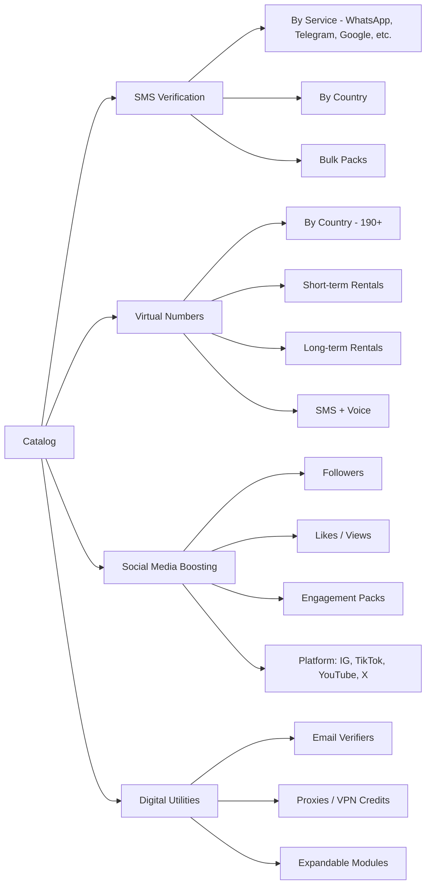

The catalog is organized into four top-level categories, each with its own taxonomy and provider mapping. New categories plug in as modules without changing the core order or billing systems.

## Taxonomy

## Product schema

| Field | Description |
| --- | --- |
| `sku` | Unique identifier |
| `category` | SMS, virtual_number, social_boost, utility |
| `provider_id` | Upstream provider mapping |
| `country_code` | ISO-3166 (when applicable) |
| `service_slug` | e.g. `whatsapp`, `instagram_followers` |
| `price_tiers` | Quantity-based pricing |
| `availability` | in_stock, low, out |
| `tags` | Free-form for search and filtering |

## Adding a new category

<Steps>
  <Step title="Define the module">
    Create a category record with slug, display name, and provider adapter.
  </Step>
  <Step title="Implement the adapter">
    Adapter must implement `reserve`, `release`, `status`, and `webhook` handlers.
  </Step>
  <Step title="Register in catalog">
    Add products in the admin catalog with pricing and availability.
  </Step>
  <Step title="Enable checkout">
    Flip the feature flag; the module becomes available to customers.
  </Step>
</Steps>
