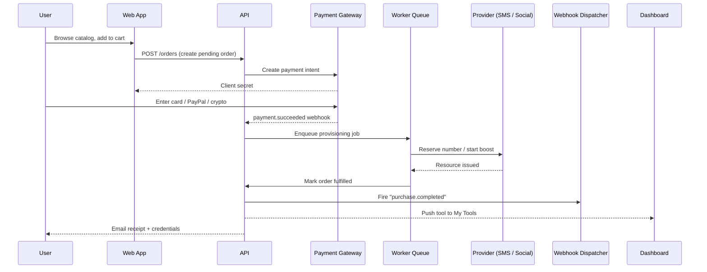
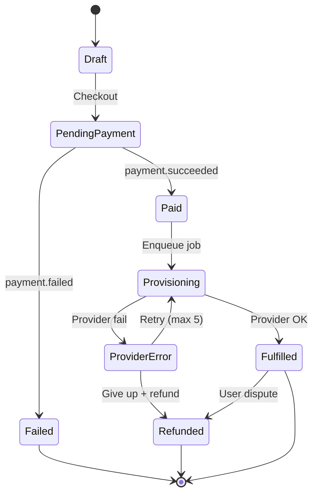

The purchase flow spans checkout, payment processing, provider provisioning, webhook fan-out, and delivery to the customer dashboard. Every step is idempotent and observable with retries on provider failures.

## Happy path

## State machine

## Failure paths

| Failure | Detection | Recovery |
| --- | --- | --- |
| Card declined | Gateway response | Prompt user to retry or switch method |
| Crypto underpaid | Blockchain listener | Ask user to top up or refund partial |
| Provider timeout | Job timeout | Retry with backoff, then refund |
| Webhook 5xx to merchant | Delivery log | Exponential retry up to 24h, alert on final fail |
| Duplicate submission | Idempotency key | Return existing order, no double charge |

## Post-purchase surfaces

<CardGroup cols={2}>
  <Card title="Dashboard Push" icon="bolt">
    The new tool appears in My Tools with credentials and controls.
  </Card>
  <Card title="Email Receipt" icon="envelope">
    Itemized receipt with invoice PDF and support link.
  </Card>
  <Card title="Webhook Fan-out" icon="broadcast-tower">
    `purchase.completed` fires to all registered merchant URLs.
  </Card>
  <Card title="Analytics Event" icon="chart-column">
    Order metrics land in the admin sales analytics in real time.
  </Card>
</CardGroup>
