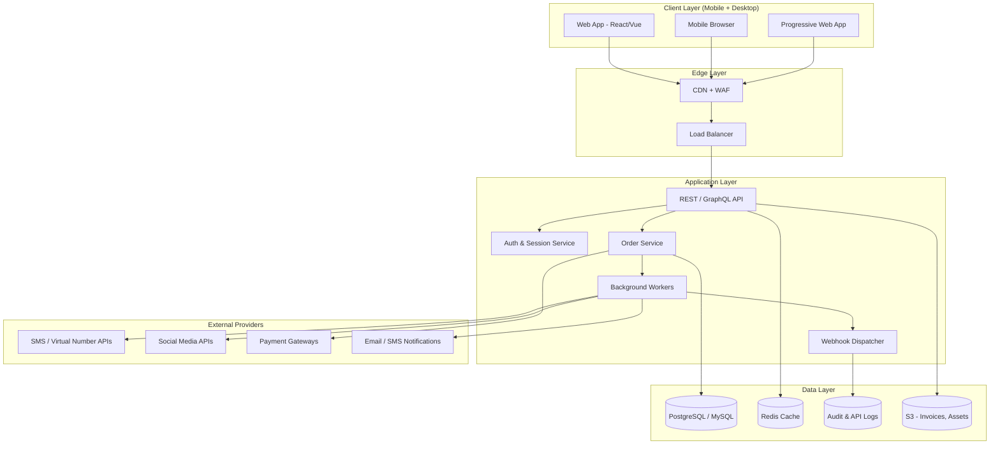

The platform uses a layered architecture that separates the client apps, application services, persistent data, and external providers. Each layer scales independently and communicates through well-defined APIs and queues.

## Layered diagram

## Layer responsibilities

| Layer | Responsibilities |
| --- | --- |
| Client | Rendering, form validation, session tokens, offline caching |
| Edge | TLS termination, DDoS protection, geo routing, static assets |
| Application | Business logic, orchestration, auth, webhook fan-out |
| Data | Durable storage, caching, audit trails, file storage |
| External | Number provisioning, social boosting, payments, notifications |

## Scaling notes

<CardGroup cols={2}>
  <Card title="Stateless API" icon="server">
    Horizontal scaling behind a load balancer with sticky-session-free auth.
  </Card>
  <Card title="Queue-Backed Provisioning" icon="list-check">
    Provider calls happen in background workers with retries and dead-letter queues.
  </Card>
  <Card title="Read Replicas" icon="database">
    Analytics and admin queries hit replicas to protect transactional load.
  </Card>
  <Card title="Modular Services" icon="puzzle-piece">
    Each category (SMS, virtual numbers, boosting) is a swappable module.
  </Card>
</CardGroup>
